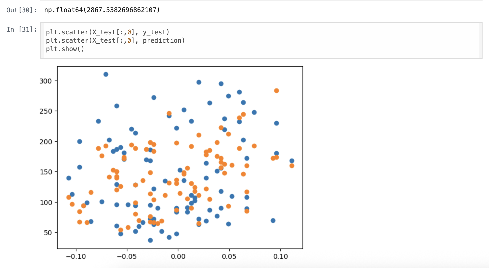
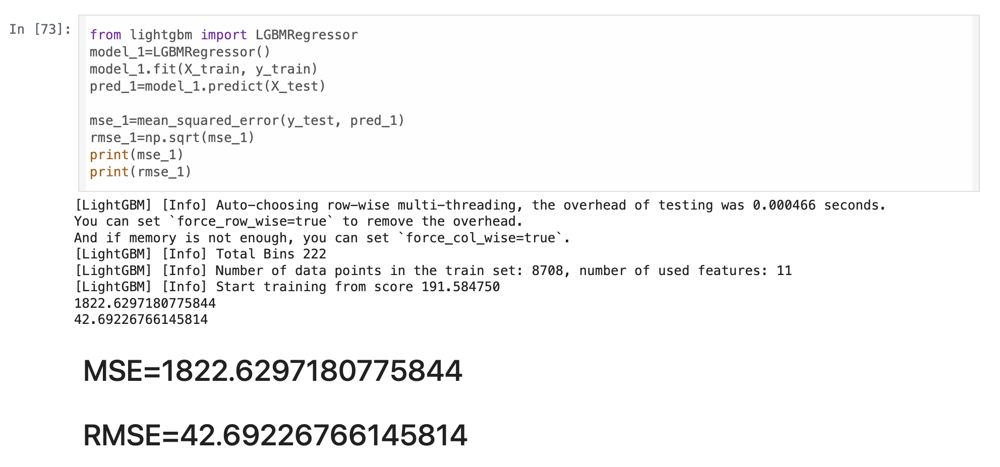
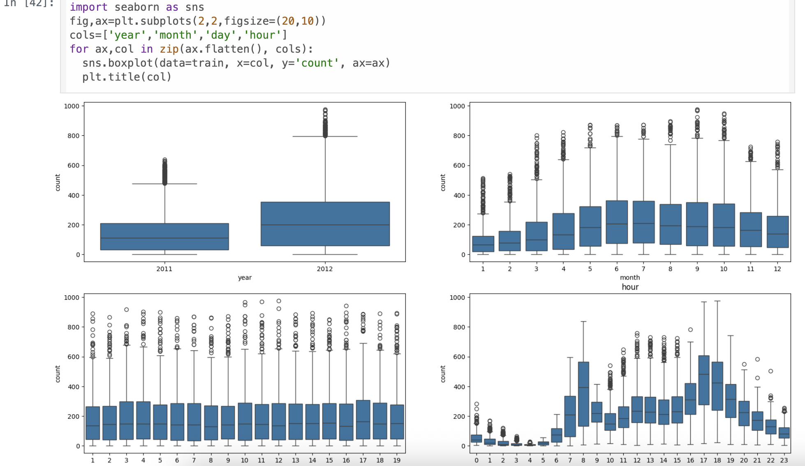
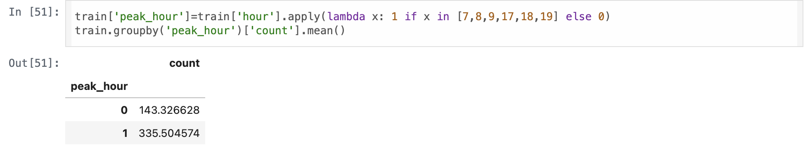
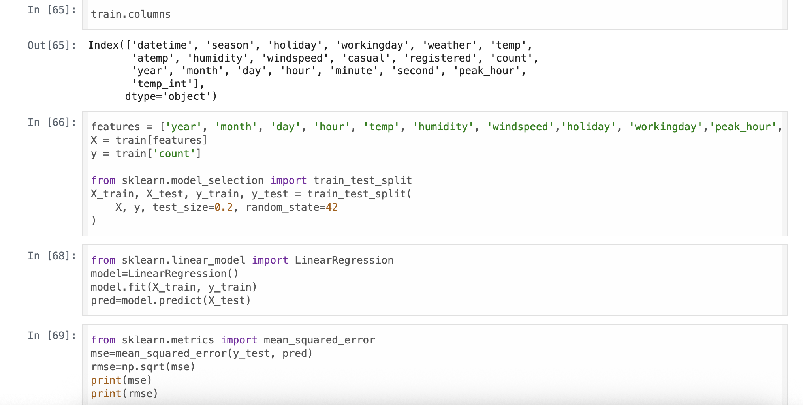

# AIFFEL Campus Online Code Peer Review Templete
- 코더 : 세냐
- 리뷰어 : 이규철


# PRT(Peer Review Template)
- [X]  **1. 주어진 문제를 해결하는 완성된 코드가 제출되었나요?**
    - 문제에서 요구하는 최종 결과물이 첨부되었는지 확인
        - 중요! 해당 조건을 만족하는 부분을 캡쳐해 근거로 첨부




노드에서 원하는 데이터 확인, 시각화, MSE 그리고  RMSE를 달성하셨습니다.
    
- [X]  **2. 전체 코드에서 가장 핵심적이거나 가장 복잡하고 이해하기 어려운 부분에 작성된 
주석 또는 doc string을 보고 해당 코드가 잘 이해되었나요?**
    - 해당 코드 블럭을 왜 핵심적이라고 생각하는지 확인
    - 해당 코드 블럭에 doc string/annotation이 달려 있는지 확인
    - 해당 코드의 기능, 존재 이유, 작동 원리 등을 기술했는지 확인
    - 주석을 보고 코드 이해가 잘 되었는지 확인
        - 중요! 잘 작성되었다고 생각되는 부분을 캡쳐해 근거로 첨부




평일과 휴일의 피크타임을 지정하셔서 새로운 피처로 만드셨습니다.

        
- [X]  **3. 에러가 난 부분을 디버깅하여 문제를 해결한 기록을 남겼거나
새로운 시도 또는 추가 실험을 수행해봤나요?**
    - 문제 원인 및 해결 과정을 잘 기록하였는지 확인
    - 프로젝트 평가 기준에 더해 추가적으로 수행한 나만의 시도, 
    실험이 기록되어 있는지 확인
        - 중요! 잘 작성되었다고 생각되는 부분을 캡쳐해 근거로 첨부



불필요한 피처는 없애고, 유의미한 새로운 피처를 넣어서 실험을 진행하셨습니다.
또한 단순 선형회귀모델이 아닌 다른 모델을 가지고 실험하셔서 RMSE를 엄청 많이 낮추셨습니다.
        
- [X]  **4. 회고를 잘 작성했나요?**
    - 주어진 문제를 해결하는 완성된 코드 내지 프로젝트 결과물에 대해
    배운점과 아쉬운점, 느낀점 등이 기록되어 있는지 확인
    - 전체 코드 실행 플로우를 그래프로 그려서 이해를 돕고 있는지 확인
        - 중요! 잘 작성되었다고 생각되는 부분을 캡쳐해 근거로 첨부

세냐님은 프로젝트를 충실하게 이행하셨고 너무 잘하셨습니다.
단지 제가 너무 실험을 간단하게 해서 아쉬웠습니다.
자세한거는 상단의 이미지들에 들어가있습니다.
        
- [X]  **5. 코드가 간결하고 효율적인가요?**
    - 파이썬 스타일 가이드 (PEP8) 를 준수하였는지 확인
    - 코드 중복을 최소화하고 범용적으로 사용할 수 있도록 함수화/모듈화했는지 확인
        - 중요! 잘 작성되었다고 생각되는 부분을 캡쳐해 근거로 첨부

코드가 각 쉘마다 잘 작성이 되어있고 가독성도 매우 좋았습니다.

# 회고(참고 링크 및 코드 개선)
저는 이번 프로젝트에서 노드의 기준만 충족하는 데에 집중했고, 그 이상은 시도하지 않았습니다.
세냐님께서는 불필요한 피처를 제거하고, 필요한 피처는 새롭게 생성하 다양한 실험을 진행하셨습니다.
단순 선형 회귀 머ㅗ델이 아닌, 캐글에서 자주 사용되는 다른 모델을 적용해 RMSE를 크게 낮추셨습니다.
이러한 과정을 보며, 앞으로는 저도 단순히 프로젝트 기준만 달성하는 데 그치지 않고,
배운 내용을 적극적으로 활용하고 다양한 실험을 시도해야겠다는 생각이 들었습니다. 세냐님 감사합니다.
```
# 리뷰어의 회고를 작성합니다.
# 코드 리뷰 시 참고한 링크가 있다면 링크와 간략한 설명을 첨부합니다.
# 코드 리뷰를 통해 개선한 코드가 있다면 코드와 간략한 설명을 첨부합니다. 
