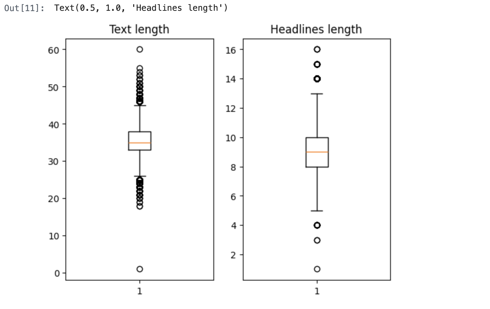
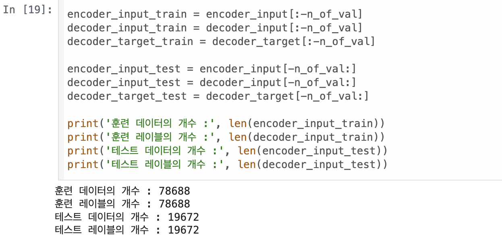
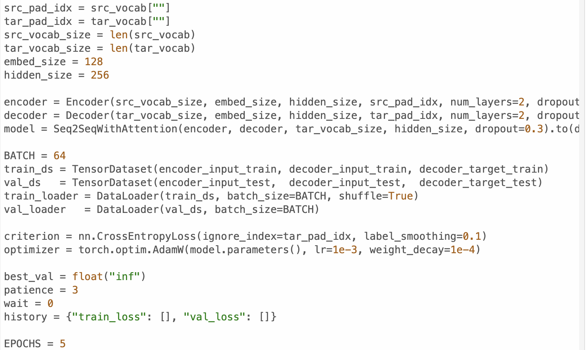
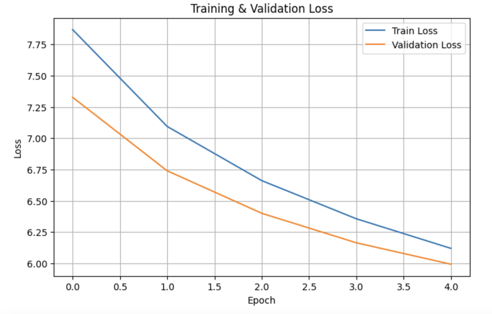
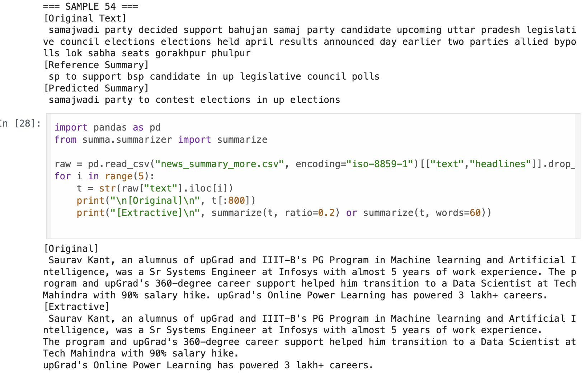

# AIFFEL Campus Online Code Peer Review Templete
- 코더 : 세냐
- 리뷰어 : 이규철


# PRT(Peer Review Template)
- [X]  **1. 주어진 문제를 해결하는 완성된 코드가 제출되었나요?**
    - 문제에서 요구하는 최종 결과물이 첨부되었는지 확인
        - 중요! 해당 조건을 만족하는 부분을 캡쳐해 근거로 첨부



요구하는 문제를 잘 해결하셨습니다. 시각화를 통해 max_len을 어떻게 할지도 잘 지정하셨습니다.
그리고 프로젝트에서 요구하는 조건을 충족하셨습니다.
    
- [X]  **2. 전체 코드에서 가장 핵심적이거나 가장 복잡하고 이해하기 어려운 부분에 작성된 
주석 또는 doc string을 보고 해당 코드가 잘 이해되었나요?**
    - 해당 코드 블럭을 왜 핵심적이라고 생각하는지 확인
    - 해당 코드 블럭에 doc string/annotation이 달려 있는지 확인
    - 해당 코드의 기능, 존재 이유, 작동 원리 등을 기술했는지 확인
    - 주석을 보고 코드 이해가 잘 되었는지 확인
        - 중요! 잘 작성되었다고 생각되는 부분을 캡쳐해 근거로 첨부



데이터를 트레인과 테스트로 잘 나누셨습니다. 이것또한 프로젝트에서 요구했습니다.
        
- [X]  **3. 에러가 난 부분을 디버깅하여 문제를 해결한 기록을 남겼거나
새로운 시도 또는 추가 실험을 수행해봤나요?**
    - 문제 원인 및 해결 과정을 잘 기록하였는지 확인
    - 프로젝트 평가 기준에 더해 추가적으로 수행한 나만의 시도, 
    실험이 기록되어 있는지 확인
        - 중요! 잘 작성되었다고 생각되는 부분을 캡쳐해 근거로 첨부



학습을 더 원할하게 하기 위해서 하이퍼파라미터 튜닝을 진행하셨습니다. 그점이 좋았습니다. 그래서 더 나은 결과를 도출하셨습니다.
        
- [X]  **4. 회고를 잘 작성했나요?**
    - 주어진 문제를 해결하는 완성된 코드 내지 프로젝트 결과물에 대해
    배운점과 아쉬운점, 느낀점 등이 기록되어 있는지 확인
    - 전체 코드 실행 플로우를 그래프로 그려서 이해를 돕고 있는지 확인
        - 중요! 잘 작성되었다고 생각되는 부분을 캡쳐해 근거로 첨부



이번 프로젝트를 하면서 느꼈던 점을 서로 얘기해봤습니다. text에는 불용어 처리를 하고 headlines에는 불용어 처리를 하지 않는게 성능이 더 좋다.
그 이유는 headlines는 문장 자체가 짧기 때문에 정보 손실이 너무 심해진다. 라는 결론이었습니다.
        
- [X]  **5. 코드가 간결하고 효율적인가요?**
    - 파이썬 스타일 가이드 (PEP8) 를 준수하였는지 확인
    - 코드 중복을 최소화하고 범용적으로 사용할 수 있도록 함수화/모듈화했는지 확인
        - 중요! 잘 작성되었다고 생각되는 부분을 캡쳐해 근거로 첨부



코드를 간결하고 보기 좋게 잘 작성해주셨습니다.

# 회고(참고 링크 및 코드 개선)
```
# 리뷰어의 회고를 작성합니다.
# 코드 리뷰 시 참고한 링크가 있다면 링크와 간략한 설명을 첨부합니다.
# 코드 리뷰를 통해 개선한 코드가 있다면 코드와 간략한 설명을 첨부합니다.

세냐님께서는 프로젝트가 원하는 바를 잘 충족하셨고 이 프로젝트에 대한 회고를 서로 얘기하는 부분이 좋았습니다.
텍스트 처리하는 테스크에서 제가 느낀 점은 먼저 데이터 전처리가 가장 중요하다. 데이터 전처리를 잘못하면 애초에
잘못된 텍스트로 학습하는 경우가 생긴다. 그리고 토크나이저도 불용어 처리가 잘 되는 토크나이저를 사용하자. 그리고
그에 맞는 잘 학습된 임베딩을 가져와 실험을 진행하자였습니다. 텍스트가 이미지에 비해서 처리할 부분도 많아서 애초에
텍스트를 일반적으로 전처리 할 수 있는 코드를 가지고 있으면서 그걸 활용해서 실험들을 진행하는 방향으로 해도 좋을거같습니다.
NLP 과정에 들어가기 전에 해야할것이 많을거 같습니다...
