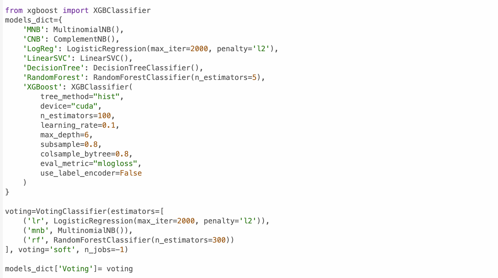
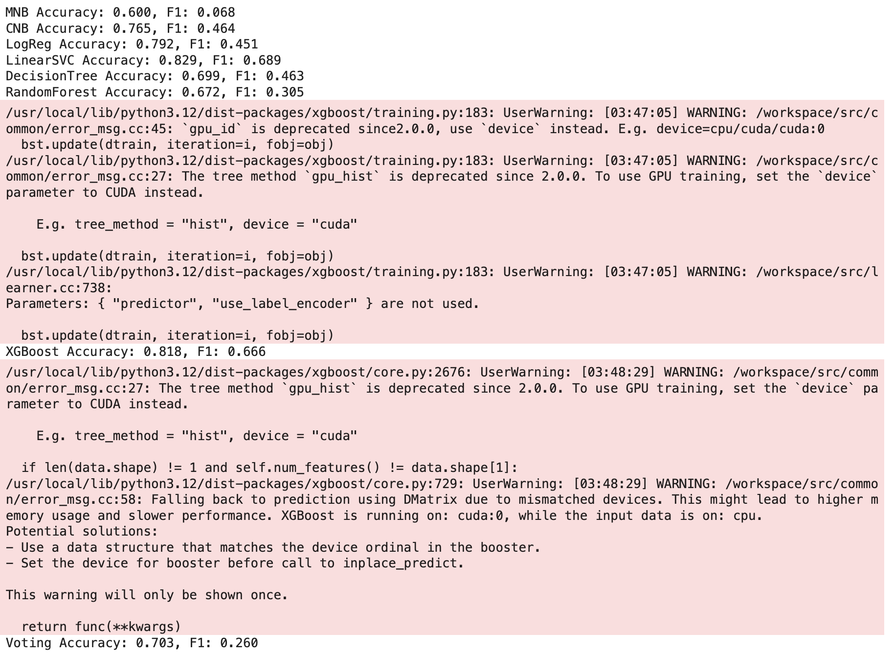
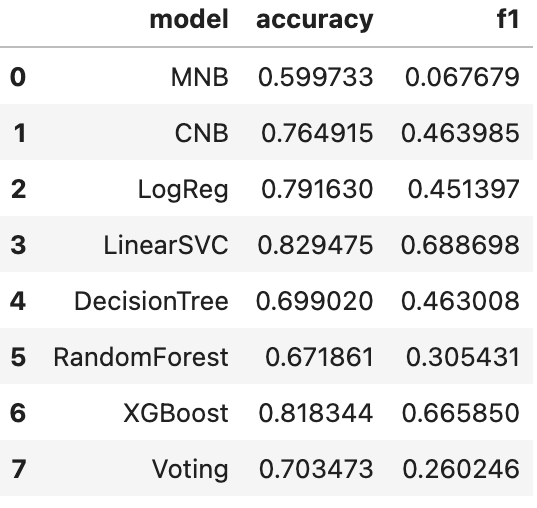
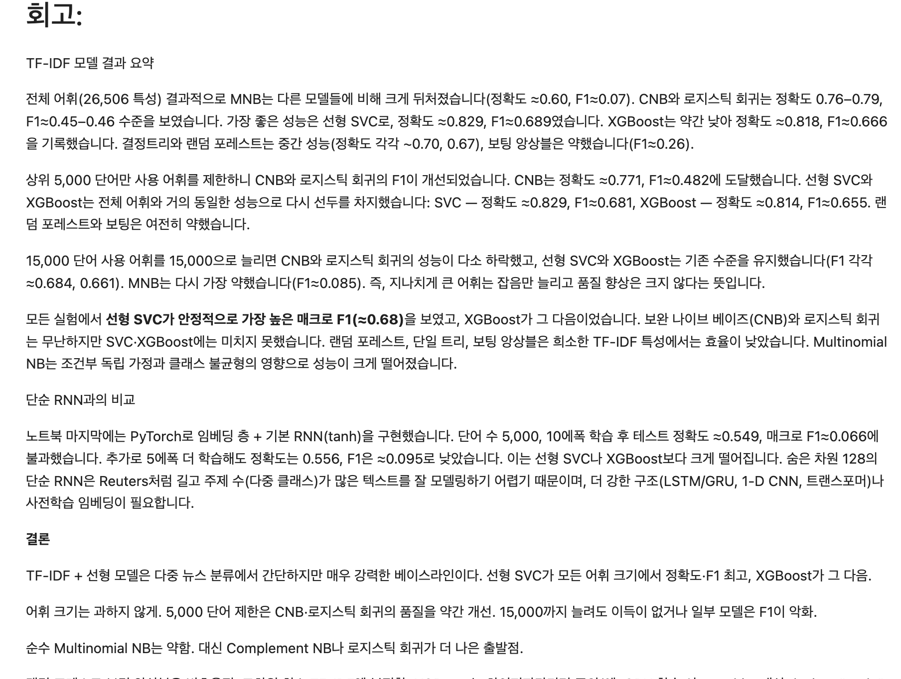
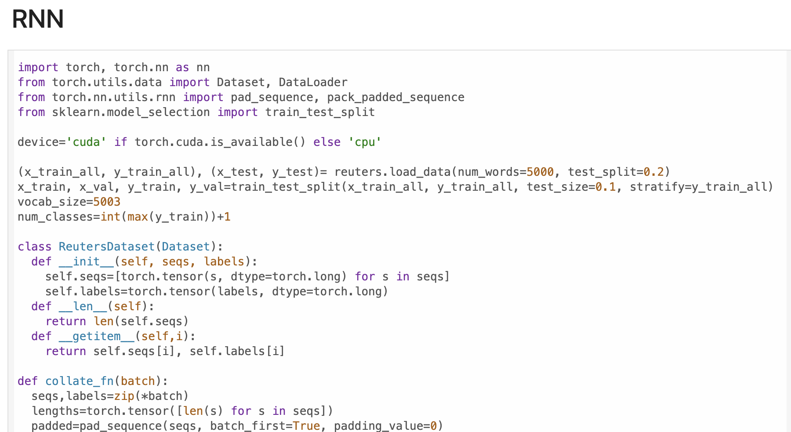

# AIFFEL Campus Online Code Peer Review Templete
- 코더 : 세냐
- 리뷰어 : 이규철


# PRT(Peer Review Template)
- [X]  **1. 주어진 문제를 해결하는 완성된 코드가 제출되었나요?**
    - 문제에서 요구하는 최종 결과물이 첨부되었는지 확인
        - 중요! 해당 조건을 만족하는 부분을 캡쳐해 근거로 첨부



문제의 요구사항인 다양한 보캡사이즈에서 머신러닝 모델과 딥러닝 모델을 비교를 잘 하셨습니다.
    
- [X]  **2. 전체 코드에서 가장 핵심적이거나 가장 복잡하고 이해하기 어려운 부분에 작성된 
주석 또는 doc string을 보고 해당 코드가 잘 이해되었나요?**
    - 해당 코드 블럭을 왜 핵심적이라고 생각하는지 확인
    - 해당 코드 블럭에 doc string/annotation이 달려 있는지 확인
    - 해당 코드의 기능, 존재 이유, 작동 원리 등을 기술했는지 확인
    - 주석을 보고 코드 이해가 잘 되었는지 확인
        - 중요! 잘 작성되었다고 생각되는 부분을 캡쳐해 근거로 첨부



다양한 머신러닝 모델과 딥러닝 모델을 잘 선언하여 활용하셨습니다. gpu활용을 위해 xgboost 사용이 참신했습니다.
        
- [X]  **3. 에러가 난 부분을 디버깅하여 문제를 해결한 기록을 남겼거나
새로운 시도 또는 추가 실험을 수행해봤나요?**
    - 문제 원인 및 해결 과정을 잘 기록하였는지 확인
    - 프로젝트 평가 기준에 더해 추가적으로 수행한 나만의 시도, 
    실험이 기록되어 있는지 확인
        - 중요! 잘 작성되었다고 생각되는 부분을 캡쳐해 근거로 첨부



gb모델이 학습이 너무 오래걸려 그 과정을 줄이고 성능을 올리기 위해 xgboost를 사용하셨습니다.
        
- [X]  **4. 회고를 잘 작성했나요?**
    - 주어진 문제를 해결하는 완성된 코드 내지 프로젝트 결과물에 대해
    배운점과 아쉬운점, 느낀점 등이 기록되어 있는지 확인
    - 전체 코드 실행 플로우를 그래프로 그려서 이해를 돕고 있는지 확인
        - 중요! 잘 작성되었다고 생각되는 부분을 캡쳐해 근거로 첨부



회고를 잘 작성하셨습니다.
        
- [X]  **5. 코드가 간결하고 효율적인가요?**
    - 파이썬 스타일 가이드 (PEP8) 를 준수하였는지 확인
    - 코드 중복을 최소화하고 범용적으로 사용할 수 있도록 함수화/모듈화했는지 확인
        - 중요! 잘 작성되었다고 생각되는 부분을 캡쳐해 근거로 첨부



코드를 깔끔하게 잘 작성하셨습니다.

# 회고(참고 링크 및 코드 개선)
```
# 리뷰어의 회고를 작성합니다.
# 코드 리뷰 시 참고한 링크가 있다면 링크와 간략한 설명을 첨부합니다.
# 코드 리뷰를 통해 개선한 코드가 있다면 코드와 간략한 설명을 첨부합니다.

이번 프로젝트에서 요구하신 사항을 세냐님께서 잘 수행하시고 회고도 잘 작성하셨습니다. 이번 데이터셋의 가장 큰 문제는 클래스 불균형이 매우 심한 데이터들의
클래스를 분류하는 문제였기 때문에 정확도 자체의 향상은 금방 됐지만 F1스코어는 올리기가 매우 힘듭니다. 그래도 다양한 머신러닝 모델들과 딥러닝 모델을 통해
실험한 결과 저같은 경우는 SVM이 가장 높은 성능을 보였습니다. 보캡사이즈별로 다양한 결과가 나왔는데 오히려 큰 보캡사이즈를 가져간다고 또 좋은게 아닐 수 
있겠구나 라는 생각이 들었습니다. 희소단어들을 넣어줘도 빈도 자체가 너무 작아 모델이 학습할때 오히려 노이즈가 낀 느낌을 가질 수 있겠다는 생각이 들었습니다.
텍스트 데이터를 학습하는 과정 자체가 정말 다양한 상황을 가정해야한다는점이 매우 어려운 부분인거같습니다. 더 많이 배워야겠습니다. 
