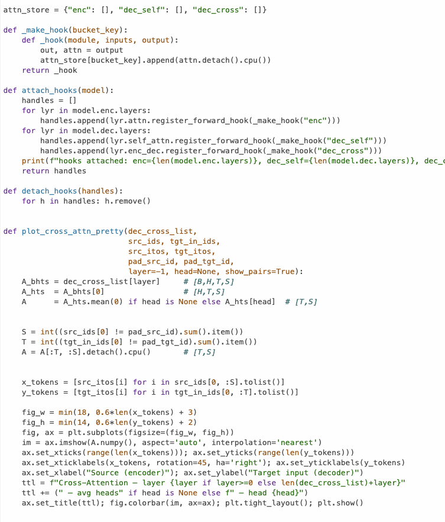
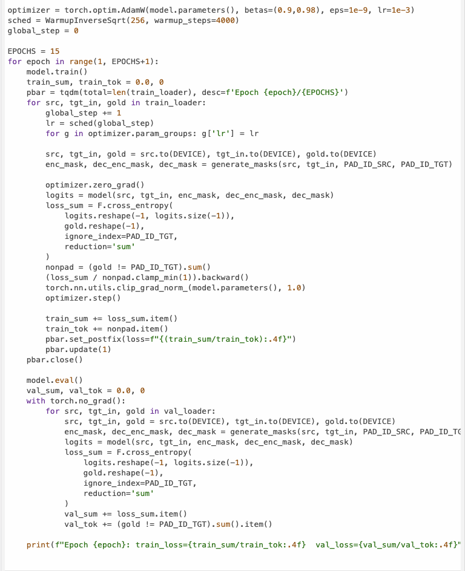

# AIFFEL Campus Online Code Peer Review Templete
- 코더 : 세냐
- 리뷰어 : 박진용


# PRT(Peer Review Template)
- [x]  **1. 주어진 문제를 해결하는 완성된 코드가 제출되었나요?**
    주어진 데이터를 기반으로 학습을 완료해 적절한 출력을 냄
- 조금 아쉽다면 아쉬운 대답이지만 데이터가 워낙 적다보니 일어난 결과라고 생각함
- -
  -
    
- [x]  **2. 전체 코드에서 가장 핵심적이거나 가장 복잡하고 이해하기 어려운 부분에 작성된 
주석 또는 doc string을 보고 해당 코드가 잘 이해되었나요?**
-  - 제가 아직 시각화를 잘 못하는데 이 코드를 보고 다시 공부해봐야겠습니다.
- 전반적으로 프로젝트의 흐름은 잘 명시해주셨는데 각 셀단위 혹은 모듈단위의 설명이 추가되면 좋겠다고 생각했습니다.
- -
  - 해당 코드 블럭을 왜 핵심적이라고 생각하는지 확인
  - 해당 코드 블럭에 doc string/annotation이 달려 있는지 확인
  - 해당 코드의 기능, 존재 이유, 작동 원리 등을 기술했는지 확인
  - 주석을 보고 코드 이해가 잘 되었는지 확인
      - 중요! 잘 작성되었다고 생각되는 부분을 캡쳐해 근거로 첨부
        
- [x]  **3. 에러가 난 부분을 디버깅하여 문제를 해결한 기록을 남겼거나
새로운 시도 또는 추가 실험을 수행해봤나요?**
- 다양한 증강을 시도하기위해 추가 사전, 증강, 등을 시도하고
- 각 시도를 종합하여 다양한 결과를 내려한게 인상적임
- 각 시도별 원인분석이 잘 되어 적절한 후조치를 통해 더 발전된 결과를 냈음
-
-
    - 문제 원인 및 해결 과정을 잘 기록하였는지 확인
    - 프로젝트 평가 기준에 더해 추가적으로 수행한 나만의 시도, 
    실험이 기록되어 있는지 확인
        - 중요! 잘 작성되었다고 생각되는 부분을 캡쳐해 근거로 첨부
        
- [x]  **4. 회고를 잘 작성했나요?**
    각 실험의 명확한 의도를 명시하였고 
- 의도에 반한 결과가 나온경우 문제분석을 하여 이를 해결하는 부분까지 명시
- 
- -
    - 주어진 문제를 해결하는 완성된 코드 내지 프로젝트 결과물에 대해
    배운점과 아쉬운점, 느낀점 등이 기록되어 있는지 확인
    - 전체 코드 실행 플로우를 그래프로 그려서 이해를 돕고 있는지 확인
        - 중요! 잘 작성되었다고 생각되는 부분을 캡쳐해 근거로 첨부
        
- [x]  **5. 코드가 간결하고 효율적인가요?**
- 저는 제미나이가 짜준 코드 이해하기도 바빠서 효율적인 코드가 안나오는데
- 정말 잘 정리하시고 간결하게 작성하시는것같습니다. 
- 팁 있으면 공유 부탁드립니다.
- -
- 
    - 파이썬 스타일 가이드 (PEP8) 를 준수하였는지 확인
    - 코드 중복을 최소화하고 범용적으로 사용할 수 있도록 함수화/모듈화했는지 확인
        - 중요! 잘 작성되었다고 생각되는 부분을 캡쳐해 근거로 첨부


# 회고(참고 링크 및 코드 개선)
```
명확한 실험 목표를 가지고 진행하는게 정말 인상적이였고 
실험에서 의도하지 않은 이슈가 생겼을때 원인을 정확히 분석하고
그에 대한 해결책또한 유의마한 결과를 보여주는게 참 보기 좋았던것 같습니다.

저도 공부 열심히 해서 그렇게 해보겠습니다.

